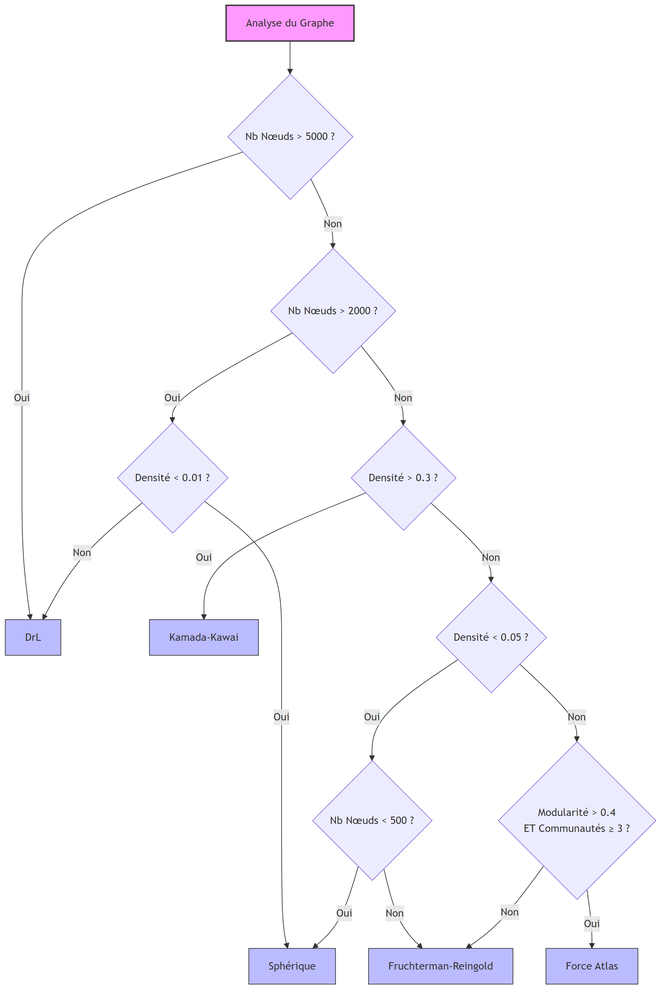
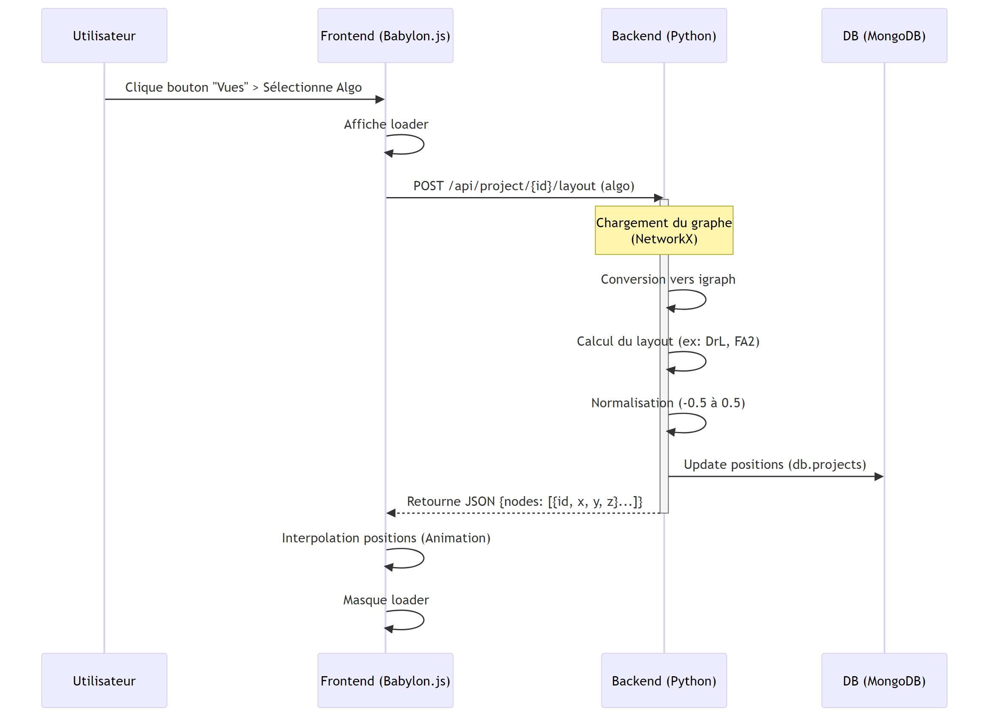

# Spatialisation des Graphes 3D

## Présentation

Ce document décrit le système de spatialisation (calcul des positions 3D) utilisé pour la visualisation de graphes dans l'application.

## Flux d'Import

### Étape 1 : Upload du fichier
L'utilisateur upload un fichier (CSV, JSON, GEXF) via l'interface web.

### Étape 2 : Analyse et mapping
Le système analyse la structure du fichier et propose un mapping automatique des colonnes vers les concepts de graphe (source, target, propriétés).

### Étape 3 : Création du graphe NetworkX
Les données sont converties en un objet graphe NetworkX en Python.

### Étape 4 : Spatialisation automatique

C'est ici que les positions 3D sont calculées. Le système utilise la bibliothèque igraph pour des calculs performants.

> **Note importante pour les fichiers GEXF** :
> Par défaut, le système **recalcule** les positions de tous les nœuds lors de l'import, même si le fichier GEXF contient déjà des coordonnées (`viz:position`). Cela garantit que le graphe est correctement normalisé et adapté à la visualisation 3D de l'application.

**Algorithme par défaut** :
À l'import, aucun choix d'algorithme n'est proposé à l'utilisateur. Le système applique toujours la logique "auto" qui sélectionne intelligemment l'algorithme optimal selon trois critères :

**Critère 1 : Taille du graphe (prioritaire pour la performance)**
- Plus de 5000 nœuds : DrL obligatoire (seul algorithme scalable)
- 2000 à 5000 nœuds : DrL par défaut, sauf si graphe très sparse (densité < 0.01) → Sphérique

**Critère 2 : Densité du graphe (pour les graphes moyens et petits, moins de 2000 nœuds)**
- Densité supérieure à 0.3 : Kamada-Kawai (graphe dense, préserve mieux la structure topologique)
- Densité inférieure à 0.05 : Graphe très sparse
  - Moins de 500 nœuds → Sphérique (visualisation globale)
  - Plus de 500 nœuds → Fruchterman-Reingold

**Critère 3 : Modularité (structure communautaire, pour les graphes de densité moyenne)**
- Si modularité supérieure à 0.4 avec au moins 3 communautés distinctes : Force Atlas (optimisé pour faire ressortir les clusters)
- Sinon : Fruchterman-Reingold (défaut équilibré)

Cette logique privilégie la qualité visuelle pour les petits graphes et la performance pour les grands. Le choix d'un algorithme spécifique est possible après l'import, via le bouton "Vues" qui permet de recalculer la spatialisation avec l'algorithme souhaité.

**Conversion NetworkX vers igraph** :
Pour optimiser les calculs, le graphe est converti de NetworkX (format Python standard) vers igraph (optimisé C). Les identifiants de nœuds sont mappés vers des indices entiers.

### Étape 5 : Normalisation et mise à l'échelle
Les coordonnées brutes sont normalisées entre -0.5 et +0.5, puis multipliées par un facteur d'échelle (par défaut 50.0) pour obtenir des positions adaptées à la visualisation 3D.

### Étape 6 : Export et sauvegarde
Le graphe avec les positions 3D est converti au format JSON et sauvegardé en base de données MongoDB.

---

## Algorithmes de Spatialisation Disponibles

Le système propose plusieurs algorithmes de spatialisation 3D, chacun avec ses caractéristiques :

### Fruchterman-Reingold (3D)
- **Description** : Algorithme standard basé sur un modèle de forces (répulsion/attraction)
- **Avantages** : Équilibré, produit des visualisations claires et lisibles
- **Implémentation** : `igraph.layout_fruchterman_reingold_3d()`
- **Complexité** : O(V² + E) par itération
- **Usage** : Défaut pour les graphes moyens (< 2000 nœuds)

### Kamada-Kawai (3D)
- **Description** : Minimisation d'énergie basée sur les distances dans le graphe
- **Avantages** : Très esthétique, préserve la topologie du graphe
- **Implémentation** : `igraph.layout_kamada_kawai_3d()`
- **Complexité** : O(V²)
- **Usage** : Graphes de taille moyenne où la structure est importante

### DrL (3D)
- **Description** : Distributed Recursive Layout, optimisé pour les grands graphes
- **Avantages** : Très rapide, scalable, fait ressortir les clusters
- **Implémentation** : `igraph.layout_drl(dim=3)`
- **Complexité** : O(V log V + E)
- **Usage** : Défaut pour les grands graphes (≥ 2000 nœuds)

### Force Atlas (3D)
- **Description** : Force-directed algorithm optimisé pour la détection de clusters, avec extension 3D via détection de communautés
- **Avantages** : Fait ressortir la structure communautaire, les nœuds connectés se rapprochent naturellement
- **Implémentation** : `fa2_modified.ForceAtlas2` + détection communautés pour axe Z
- **Complexité** : O(V² + E) avec optimisation Barnes-Hut
- **Usage** : Graphes avec modularité > 0.4 et 3+ communautés distinctes

### Sphérique
- **Description** : Distribution uniforme sur une sphère
- **Avantages** : Navigation immersive, vue d'ensemble claire
- **Implémentation** : `igraph.layout_sphere()`
- **Complexité** : O(V)
- **Usage** : Exploration VR/AR, graphes très denses

### Grille 3D
- **Description** : Alignement sur une grille tridimensionnelle
- **Avantages** : Positions fixes, facile à comparer
- **Implémentation** : `igraph.layout_grid_3d()`
- **Complexité** : O(V)
- **Usage** : Comparaison de structures, debuggage

### Circulaire
- **Description** : Disposition en cercle dans le plan XY avec variation en Z
- **Avantages** : Symétrique, révèle les cycles
- **Implémentation** : Custom (basé sur igraph + extension 3D)
- **Complexité** : O(V)
- **Usage** : Graphes avec structure circulaire

### Aléatoire
- **Description** : Positions aléatoires uniformes
- **Avantages** : Baseline de comparaison
- **Implémentation** : `igraph.layout_random_3d()`
- **Complexité** : O(V)
- **Usage** : Tests, comparaisons

---

## Performance Qualitative

**Petits graphes (< 500 nœuds)** :
Tous les algorithmes s'exécutent en moins d'une seconde. Privilégier Kamada-Kawai ou Fruchterman-Reingold pour la qualité visuelle.

**Graphes moyens (500-2000 nœuds)** :
Fruchterman-Reingold reste rapide (quelques secondes). DrL commence à montrer son intérêt en termes de vitesse.

**Grands graphes (> 2000 nœuds)** :
DrL devient indispensable. Fruchterman-Reingold devient trop lent (minutes). Kamada-Kawai n'est plus recommandé.

**Très grands graphes (> 10000 nœuds)** :
Seuls DrL, Sphérique et layouts géométriques (Grille, Circulaire) restent utilisables.

---

## Architecture Technique

### Backend (Python)
- **NetworkX** : Construction et manipulation du graphe
- **igraph** : Calculs de layout (binding C++, très performant)
- **NumPy/SciPy** : Opérations matricielles et normalisation

### Frontend (TypeScript/Babylon.js)
- **Babylon.js** : Moteur de rendu 3D WebGL
- **WebXR** : Support VR/AR natif
- **React** : Interface utilisateur

### Base de données
- **MongoDB** : Stockage des projets et graph_data
- **Redis** : Cache pour les calculs asynchrones (Celery)

---

## Changement de Layout Post-Import

L'utilisateur peut recalculer le layout à tout moment via le bouton "Vues" :

1. Sélectionner un algorithme dans le menu déroulant
2. Le backend recalcule les positions 3D
3. Le frontend reçoit les nouvelles coordonnées
4. La visualisation se met à jour avec animation

Le recalcul ne modifie QUE les positions (x, y, z). Les nœuds, arêtes et propriétés restent inchangés.

