# Guide d'Utilisation - GraphXR

Guide complet pour utiliser la plateforme de visualisation de graphes 3D/VR.

---

## Table des Matieres

1. [Page d'Accueil](#1-page-daccueil)
2. [Authentification](#2-authentification)
3. [Tableau de Bord](#3-tableau-de-bord)
4. [Creation d'un Projet](#4-creation-dun-projet)
5. [Visualisation 3D](#5-visualisation-3d)
6. [Filtres et Recherche](#6-filtres-et-recherche)
7. [Options et Edition](#7-options-et-edition)
8. [Partage](#8-partage)
9. [Mode VR](#9-mode-vr)
10. [Galerie Publique](#10-galerie-publique)
11. [Administration](#11-administration)

---

## 1. Page d'Accueil

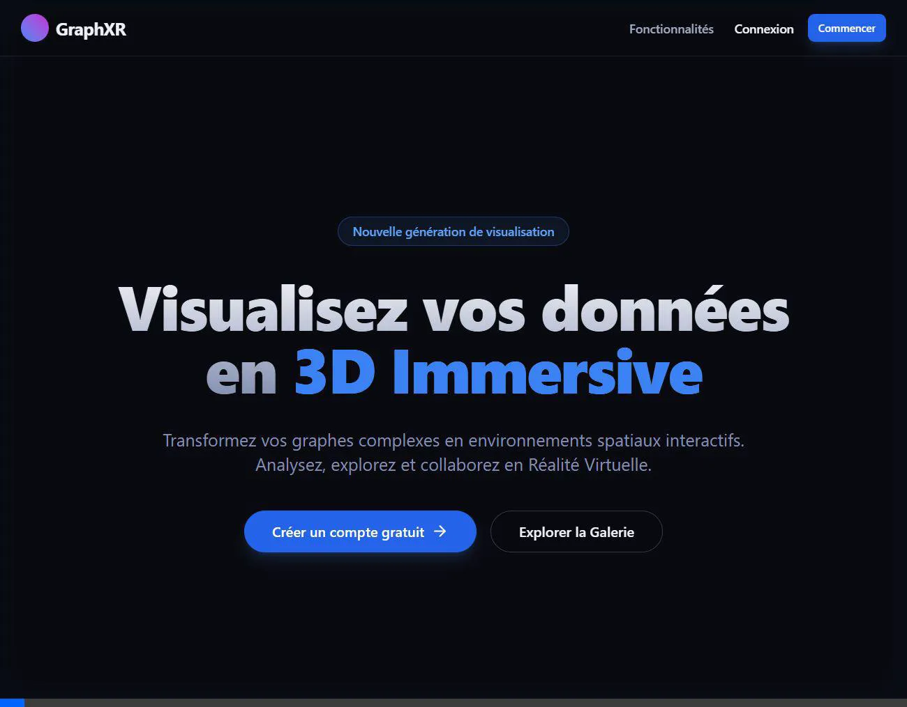

La page d'accueil presente les fonctionnalites principales de GraphXR:
- **Visualisation 3D**: Explorez vos graphes dans un espace tridimensionnel
- **Mode VR**: Experience immersive compatible WebXR
- **Partage**: Generez des liens de partage

**Actions disponibles:**
| Bouton              | Action                         |
| ------------------- | ------------------------------ |
| Commencer           | Acces a la connexion           |
| Creer un compte     | Inscription nouvel utilisateur |
| Explorer la Galerie | Voir les projets publics       |

---

## 2. Authentification

### Connexion

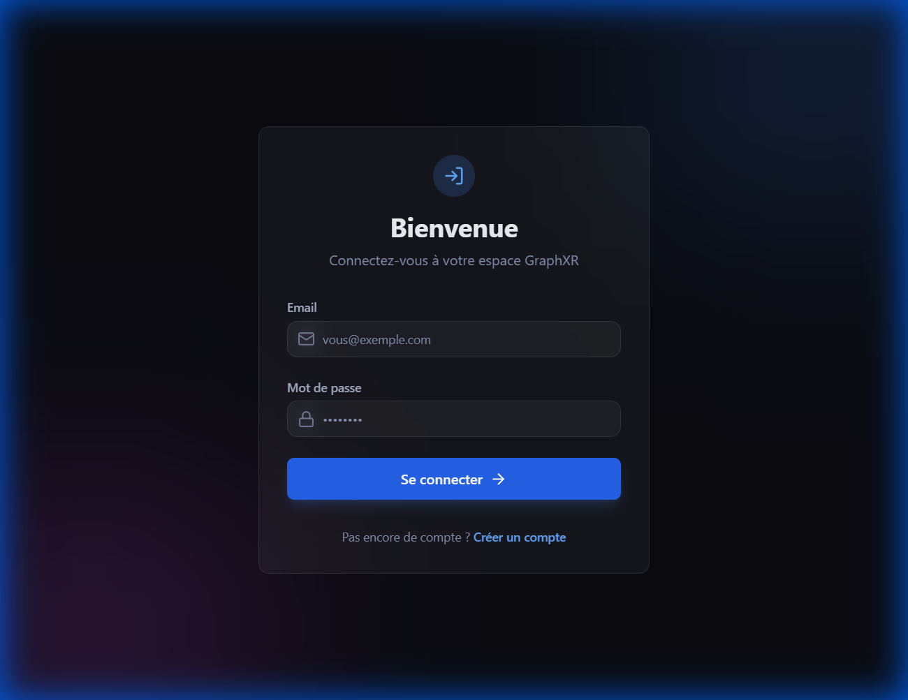

1. Entrez votre **email**
2. Entrez votre **mot de passe**
3. Cliquez sur **Se connecter**

### Inscription

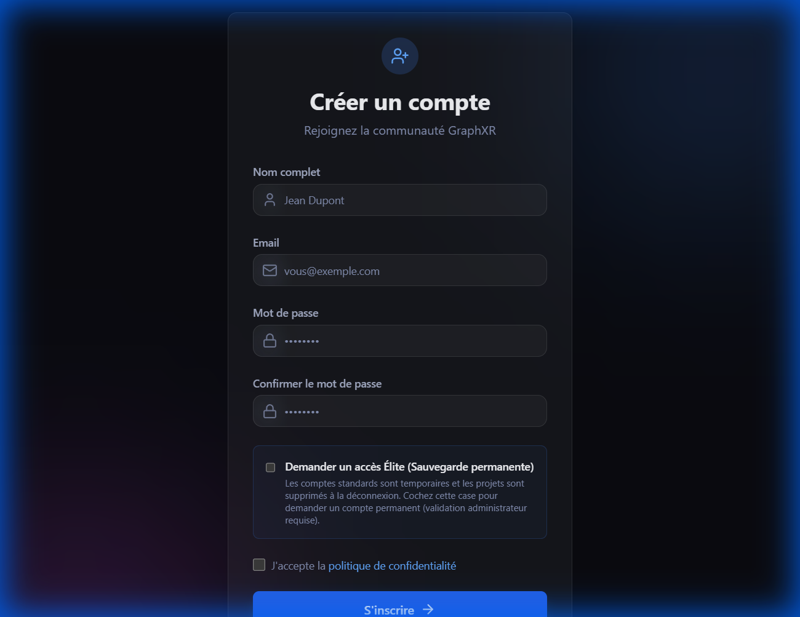

1. Remplissez votre **nom complet**
2. Entrez votre **email**
3. Choisissez un **mot de passe** (min. 8 caracteres)
4. Confirmez le mot de passe
5. (Optionnel) Cochez **Demander un acces Elite**
6. Acceptez la politique de confidentialite
7. Cliquez sur **S'inscrire**

### Types de Comptes

| Plan      | Projets               | Partage           | Galerie |
| --------- | --------------------- | ----------------- | ------- |
| **Free**  | Temporaires (session) | Durant la session | Non     |
| **Elite** | Permanents            | Liens durables    | Oui     |

---

## 3. Tableau de Bord

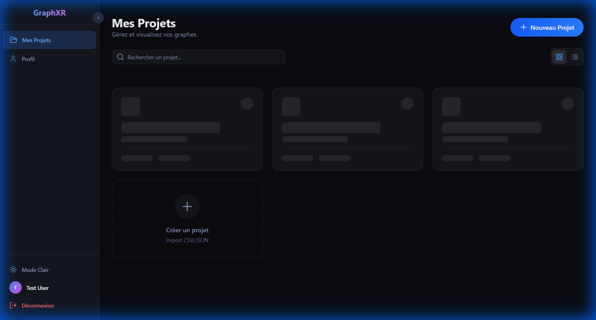

Le tableau de bord affiche tous vos projets:

- **Recherche**: Barre de recherche par nom de projet
- **Vue grille/liste**: Basculer l'affichage (icones en haut a droite)
- **Nouveau Projet**: Bouton bleu pour creer un projet
- **Cartes projet**: Cliquez pour ouvrir la visualisation 3D

---

## 4. Creation d'un Projet

### Etape 1: Selection du Fichier

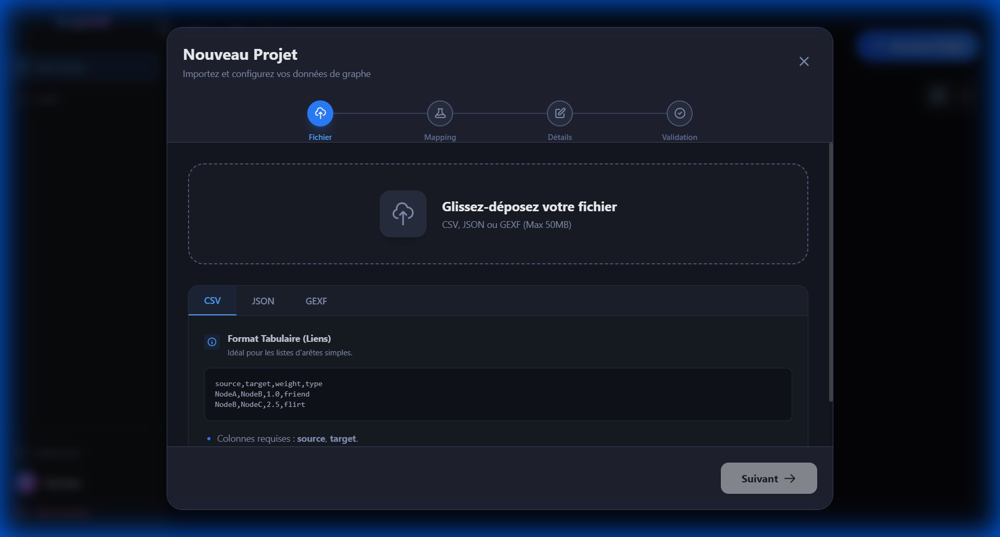

1. Cliquez sur **Nouveau Projet**
2. Glissez-deposez votre fichier ou cliquez pour parcourir
3. Selectionnez le format: **CSV**, **JSON** ou **GEXF**

### Format JSON (Node-Link)

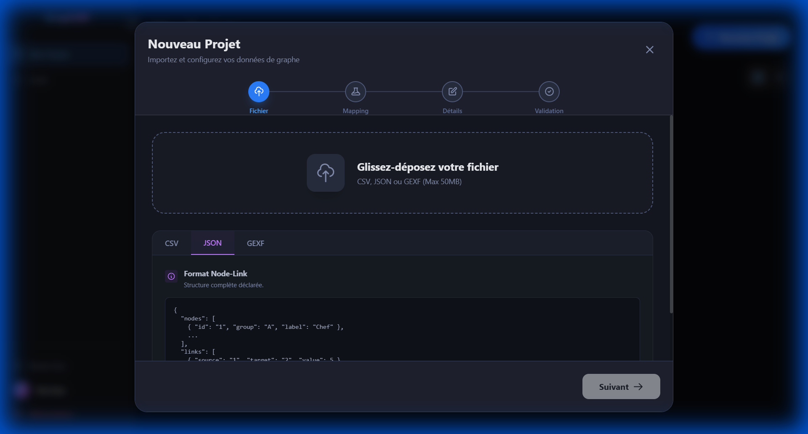

Structure attendue:
```json
{
  "nodes": [
    { "id": "1", "label": "Noeud A", "group": "A" }
  ],
  "links": [
    { "source": "1", "target": "2" }
  ]
}
```

### Etape 2: Mapping (automatique)

Le systeme detecte automatiquement:
- **Source**: Colonne origine des liens
- **Target**: Colonne destination
- **Poids**: Attribut optionnel

### Etape 3: Details du Projet

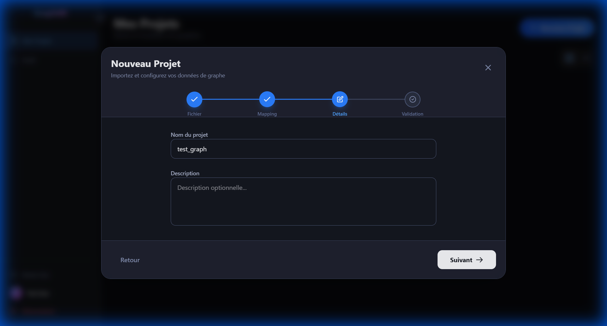

1. **Nom du projet**: Donnez un nom descriptif
2. **Description**: Description optionnelle
3. Cliquez sur **Suivant**

### Etape 4: Validation

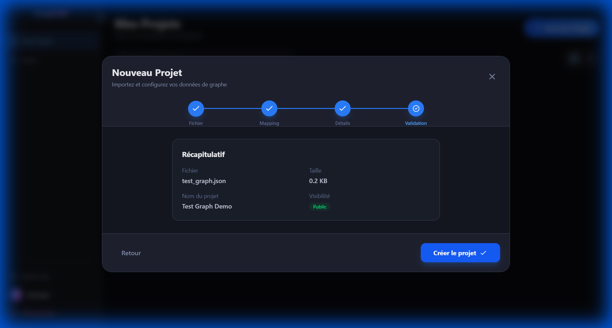

Verifiez le recapitulatif:
- **Fichier**: Nom et taille
- **Nom du projet**: Votre titre
- **Visibilite**: Public ou Prive

Cliquez sur **Creer le projet** pour lancer le traitement.

---

## 5. Visualisation 3D


### Navigation Camera

| Action          | Controle              |
| --------------- | --------------------- |
| Rotation        | Clic gauche + Glisser |
| Zoom            | Molette souris        |
| Pan             | Clic droit + Glisser  |
| Selection noeud | Clic sur un noeud     |

### Barre de Controles

En bas de l'ecran:

| Bouton       | Description                            |
| ------------ | -------------------------------------- |
| **Reset**    | Recentrer la camera                    |
| **Layout**   | Changer l'algorithme de spatialisation |
| **Labels**   | Afficher/masquer les etiquettes        |
| **Filtres**  | Ouvrir le panneau de filtres           |
| **VR**       | Activer le mode realite virtuelle      |
| **Editer**   | Modifier les parametres du projet      |
| **Export**   | Exporter les donnees                   |
| **Partager** | Generer un lien de partage             |

### Algorithmes de Layout

| Algorithme               | Description             | Usage Recommande      |
| ------------------------ | ----------------------- | --------------------- |
| **Fruchterman-Reingold** | Separation equilibree   | Graphes < 1000 noeuds |
| **Kamada-Kawai**         | Preserve les distances  | Petits graphes        |
| **DrL**                  | Optimise grands graphes | > 1000 noeuds         |
| **Force Atlas**          | Detection communautes   | Clusters              |
| **Spherique**            | Distribution sur sphere | VR immersif           |
| **Grille**               | Disposition reguliere   | Comparaison           |
| **Aleatoire**            | Position aleatoire      | Test                  |

---

## 6. Filtres et Recherche

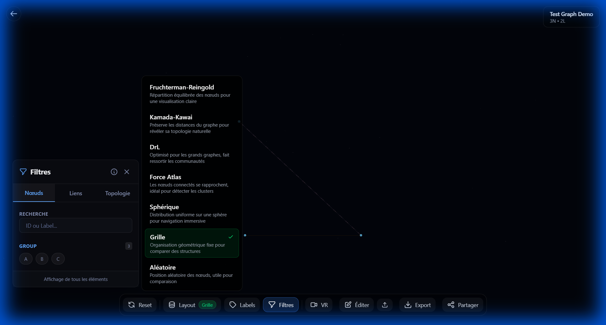

### Onglets

1. **Noeuds**: Filtrer par attributs des noeuds
2. **Liens**: Filtrer par attributs des liens
3. **Topologie**: Navigation structurelle

### Recherche

- Tapez un ID ou label pour trouver un noeud
- Les resultats s'affichent en temps reel

### Filtres par Attributs

- **Group**: Selectionnez les categories a afficher
- Les noeuds non-selectionnes sont masques

### Filtres Topologiques

- **Voisinage N sauts**: Affiche les noeuds a distance N
- **Chemin le plus court**: Entre deux noeuds selectionnes

---

## 7. Options et Edition

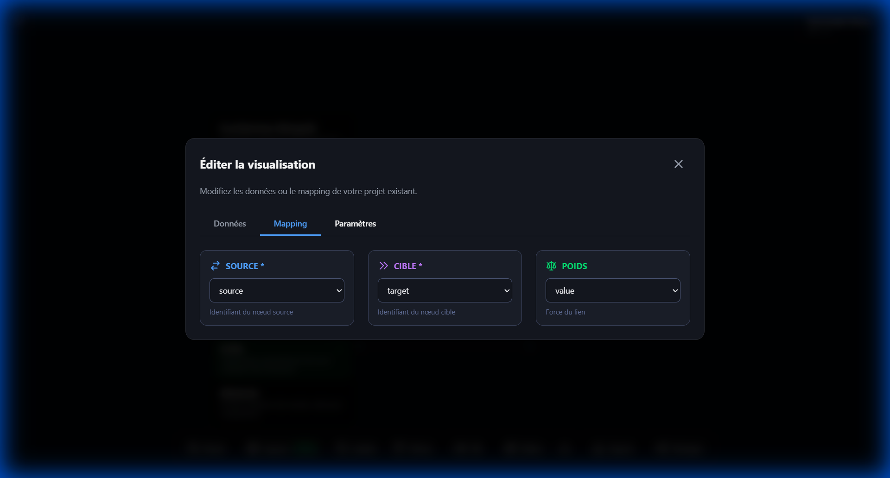

### Onglets

| Onglet         | Description                  |
| -------------- | ---------------------------- |
| **Donnees**    | Voir les donnees brutes      |
| **Mapping**    | Modifier source/target/poids |
| **Parametres** | Options de visualisation     |

### Mapping

Modifiez les colonnes utilisees:
- **SOURCE**: Colonne origine des liens
- **CIBLE**: Colonne destination
- **POIDS**: Attribut de ponderation

Cliquez sur **Sauvegarder** pour appliquer.

---

## 8. Partage

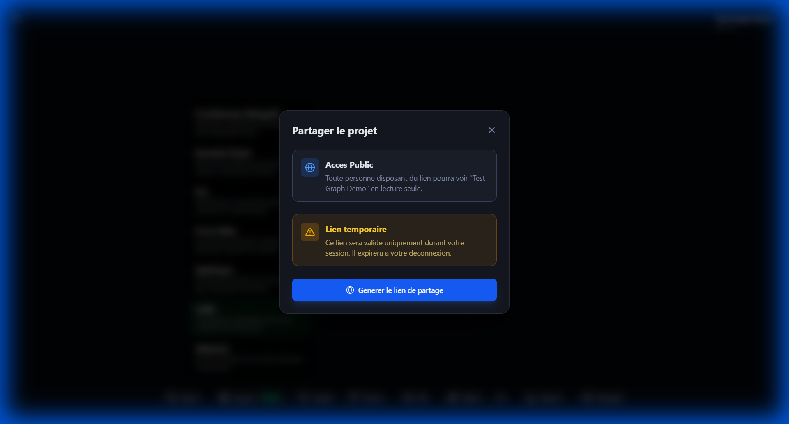

### Options de Partage

| Option              | Description                    |
| ------------------- | ------------------------------ |
| **Acces Public**    | Lien en lecture seule          |
| **Lien temporaire** | Expire a la deconnexion (Free) |
| **Lien permanent**  | Ne expire pas (Elite)          |

### Generer un Lien

1. Cliquez sur **Partager** dans la barre de controles
2. Cliquez sur **Generer le lien de partage**
3. Copiez l'URL generee

> **Note Free**: Les liens expirent a la fin de session.

---

## 9. Mode VR

Activez le mode VR avec un casque compatible WebXR (Meta Quest, etc.).

### Controles VR

| Controleur      | Action           |
| --------------- | ---------------- |
| Joystick gauche | Deplacement      |
| Joystick droit  | Rotation         |
| Trigger         | Selection noeud  |
| Grip            | Saisir le graphe |
| A/X             | Menu radial      |

### Menu Radial VR

- Changement de layout
- Recentrage camera
- Quitter VR

---

## 10. Galerie Publique

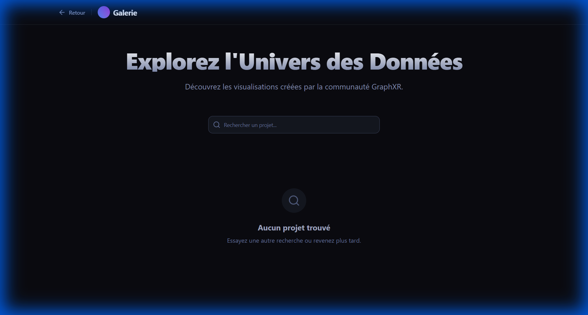

La galerie affiche les projets publies par les utilisateurs Elite.

**Fonctionnalites:**
- **Recherche**: Filtrer par nom
- **Apercu**: Cliquez pour visualiser

---

## 11. Administration

*Accessible uniquement aux administrateurs.*

### Dashboard Admin

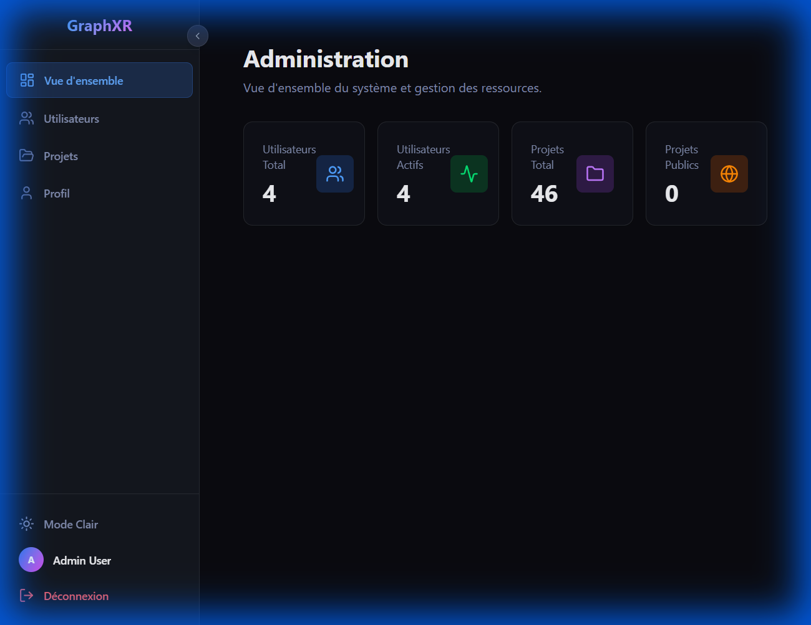

Statistiques globales:
- Utilisateurs totaux et actifs
- Projets totaux et publics

### Gestion Utilisateurs

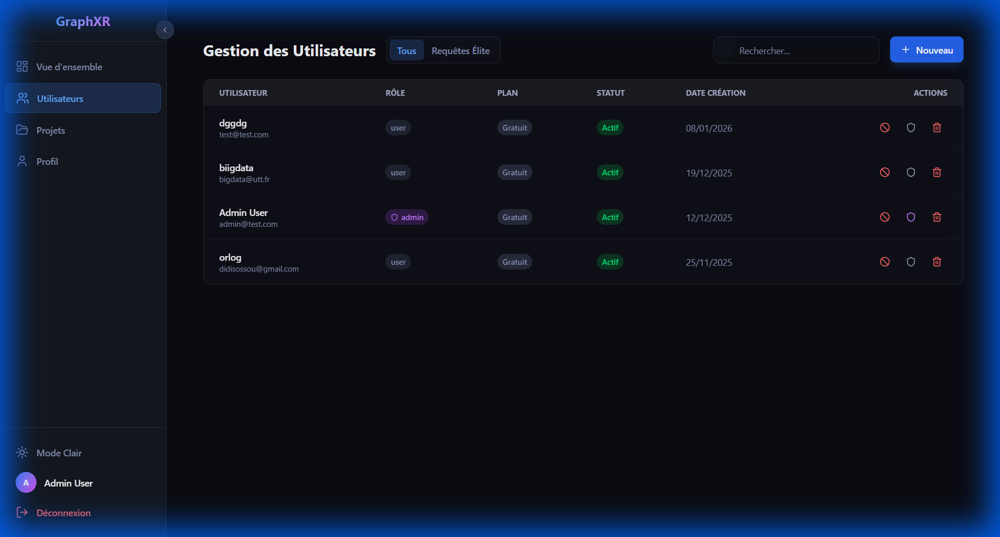

| Action        | Description            |
| ------------- | ---------------------- |
| Valider Elite | Approuver une demande  |
| Bannir        | Bloquer un utilisateur |
| Supprimer     | Supprimer le compte    |

### Gestion Projets

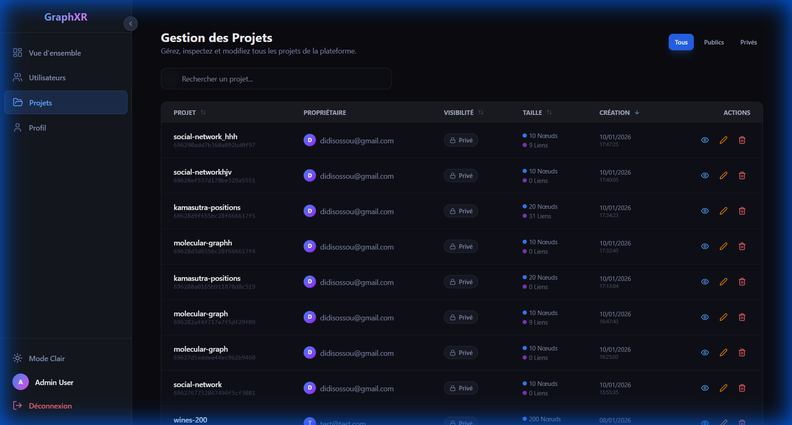

| Filtre  | Description               |
| ------- | ------------------------- |
| Tous    | Afficher tous les projets |
| Publics | Projets en galerie        |
| Prives  | Projets non partages      |

---

## Raccourcis Clavier

| Raccourci | Action               |
| --------- | -------------------- |
| `Echap`   | Fermer panneau/modal |
| `R`       | Reset camera         |
| `F`       | Ouvrir filtres       |
| `L`       | Labels on/off        |

---

## Support

- [README.md](../README.md) - Documentation technique
- [ROADMAP.md](../ROADMAP.md) - Fonctionnalites a venir
